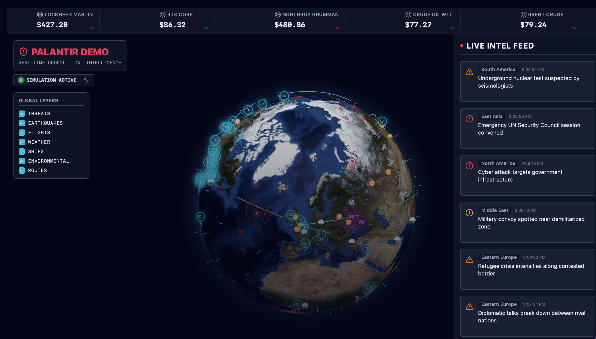
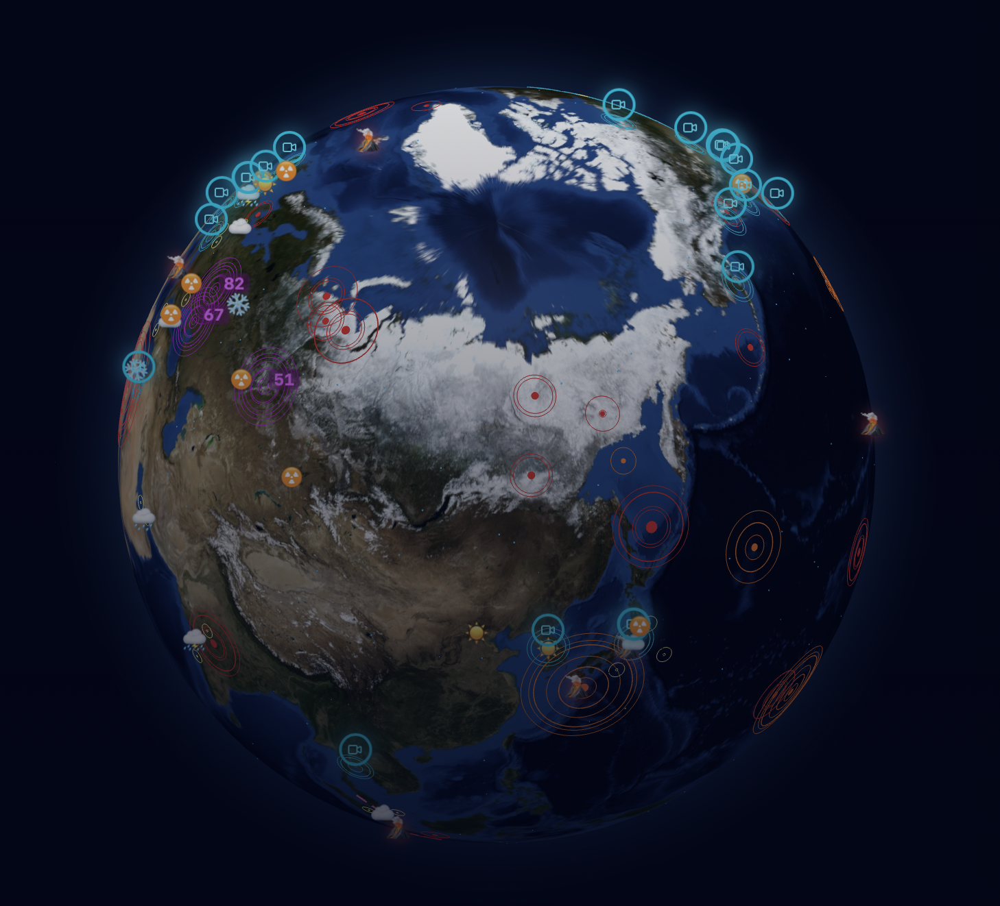
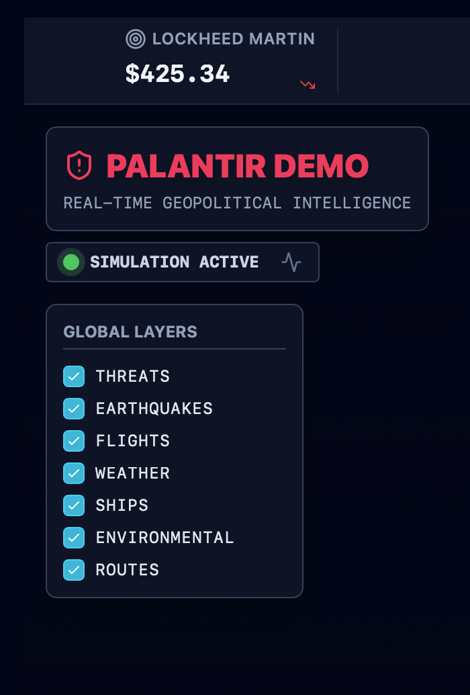
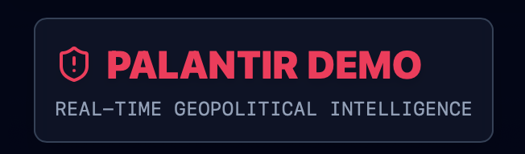

# ⚛️ PALANTIR DEMO
## Real-Time Global Intelligence Platform

<div align="center">



**Advanced geopolitical monitoring and worldwide threat assessment system**

[](https://react.dev)
[](https://vitejs.dev)
[](https://threejs.org)

</div>

---

## 🎯 Mission Brief

PALANTIR DEMO is an enterprise-grade intelligence visualization platform providing real-time situational awareness across geopolitical, environmental, and logistical dimensions. Built for operational excellence and rapid decision-making.

### Intelligence Domains

| Domain | Capabilities |
|--------|-------------|
| **🔴 Geopolitical Threat Assessment** | Real-time conflict zone monitoring, risk quantification, strategic hotspot tracking |
| **🌋 Environmental Hazards** | Seismic activity, volcanic events, atmospheric radiation, lightning strike detection |
| **✈️ Global Logistics** | Live aircraft tracking, maritime route visualization, cargo flow analysis |
| **⛅ Meteorological Intelligence** | Weather pattern analysis, atmospheric conditions, climate event correlation |
| **📡 Electronic Surveillance** | Global camera network integration, strategic location streaming, reconnaissance feeds |

---

## 📊 Dashboard Overview

<div align="center">



*Interactive 3D globe with multi-layer data visualization*

</div>

### Core Capabilities

**Dynamic Global Visualization**
- High-performance 3D globe rendering with WebGL acceleration
- Multi-layered data overlay system
- Interactive drill-down capabilities for detailed analysis
- Seamless globe rotation and zoom navigation

**Advanced Event Intelligence**
- Real-time event detection and classification
- Contextual information panels with metadata
- Historical threat analysis and pattern recognition
- Automated risk scoring algorithms

**Operational Command Features**
- War room aesthetic with professional dark-mode interface
- High-contrast design for extended operational sessions
- Responsive layout for multi-monitor deployments
- Touch-enabled for tactical command centers

---

## 🚀 Deployment & Operations

<div align="center">



*System monitoring and real-time data integration*

</div>

### Quick Launch

```bash
# Foundation setup
npm install

# Development deployment
npm run dev

# Production build
npm run build

# GitHub Pages deployment
npm run deploy
```

### System Requirements

| Requirement | Specification |
|-------------|--------------|
| **Node.js** | v20+ LTS |
| **npm** | Latest version |
| **Browser** | Modern (Chrome, Firefox, Safari, Edge) |
| **GPU** | Recommended for optimal performance |

### Cloud Deployment

Configure GitHub Pages deployment:

1. Navigate to repository **Settings** → **Pages**
2. Set source to **gh-pages branch** from **root folder**
3. Run `npm run deploy` to publish

The system will automatically build and deploy to your GitHub Pages instance.

---

## ⚙️ Technical Architecture

<div align="center">



*Advanced monitoring and analytics dashboard*

</div>

### Technology Stack

```
Frontend Framework       React 19 (Vite)
3D Visualization        react-globe.gl (Three.js)
Styling System          Tailwind CSS 4.0
UI Components           Lucide-React
State Management        React Hooks
Build System            Vite 6
Simulation Engine       Custom High-Performance
```

### Component Architecture

| Component | Function |
|-----------|----------|
| **GlobeComponent** | 3D visualization engine and viewport management |
| **Dashboard** | Main operational interface and layout |
| **EventDetailModal** | Deep-dive analysis for individual events |
| **MarketTickers** | Real-time data feeds and market indicators |
| **NewsFeed** | Intelligence bulletin aggregation system |
| **VideoModal** | Surveillance feed integration and playback |

---

## 🔧 Development Workflow

### Local Development

```bash
# Clone and setup
git clone <repository-url>
cd palantir-demo

# Install dependencies
npm install

# Start hot-reload development server
npm run dev
```

Access at `http://localhost:5173` with live HMR updates.

### Build Pipeline

```bash
# Production optimization
npm run build

# Output: dist/ directory ready for deployment
```

### Preview Production Build

```bash
npm run preview
```

---

## 📋 Project Structure

```
palantir-demo/
├── src/
│   ├── components/          # React component modules
│   │   ├── Dashboard.jsx
│   │   ├── GlobeComponent.jsx
│   │   ├── EventDetailModal.jsx
│   │   ├── MarketTickers.jsx
│   │   ├── NewsFeed.jsx
│   │   └── VideoModal.jsx
│   │
│   ├── data/                # Data simulation engines
│   │   ├── mockEngine.js
│   │   ├── cameras.js
│   │   └── maritimeRoutes.js
│   │
│   ├── App.jsx              # Root application component
│   ├── main.jsx             # Entry point
│   └── index.css            # Global styles
│
├── readme-assets/           # Documentation graphics
├── index.html               # HTML template
├── vite.config.js           # Build configuration
└── package.json             # Dependencies manifest
```

---

## 🎓 Educational & Demonstration Use

This platform demonstrates enterprise-level real-time intelligence visualization capabilities. Designed for educational exploration of:

- Advanced React patterns and performance optimization
- WebGL and 3D web visualization techniques
- Real-time data streaming architecture
- High-fidelity UI/UX for command centers
- Geospatial data visualization methodology

---

## 📄 License & Attribution

Created for demonstration and educational purposes.

<div align="center">

**For inquiries**: Check repository issues or documentation

</div>
